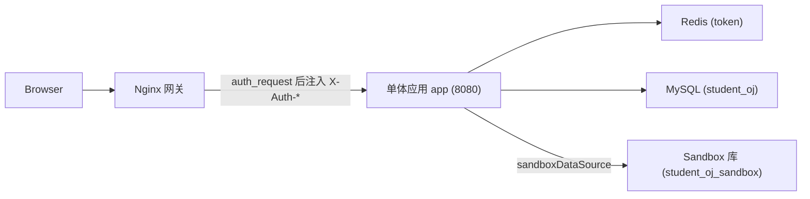

# 智能 SQL OJ 判题系统

本项目仅保留单体架构：前端 Vue 应用、单体后端 `backend/app`、MySQL、Redis 与 Nginx 网关。

## 技术栈

- 前端：Vue 3、TypeScript、Vite、Element Plus、Pinia、ECharts、Monaco Editor
- 后端：Java 21、Spring Boot 3、MyBatis Plus，单体应用端口 `8080`
- 基础设施：MySQL 8.4、Redis 7.4、Docker、Nginx
- AI：DeepSeek/OpenAI 兼容接口，未配置密钥时使用规则生成兜底

## 项目结构

```text
.
├─ src                         # 前端源码
├─ backend
│  ├─ app                      # 单体后端应用
│  │  └─ src/main/java/com/studentoj
│  │     ├─ auth               # 认证鉴权
│  │     ├─ problem            # 题目与提交
│  │     ├─ judge              # 判题
│  │     ├─ sandbox            # SQL 沙箱执行
│  │     ├─ ai                 # AI 建议
│  │     ├─ statistics         # 统计与活跃度
│  │     ├─ teacher            # 教师管理
│  │     ├─ common             # 公共组件
│  │     └─ leetcodecrawler    # 题库爬虫
│  ├─ Dockerfile               # 后端镜像
│  └─ pom.xml                  # Maven 父工程，仅包含 app 模块
├─ deploy
│  ├─ mysql                    # 初始化脚本与题库种子
│  └─ nginx/default.conf       # 单体网关配置，转发到 app:8080
├─ Dockerfile                  # 前端 Nginx 镜像
├─ docker-compose.yml          # 单体部署编排
└─ .github/workflows/ci.yml
```

## 本地前端运行

```bash
npm install
npm run dev
```

访问：

```text
http://localhost:5173
```

本地 `npm run dev` 已内置 Vite 代理，将 `/api` 转发到 `http://localhost:8080`。因此本地开发时：
- 前端直接访问 `http://localhost:5173`；
- 后端单独启动在 `8080`；
- 不需要单独配置 Nginx。

生产环境仍通过 Nginx `/api` 网关统一转发。Nginx `auth_request` 会在转发到后端前注入内部鉴权头。

## 本地后端运行

需要 JDK 21。打包单体应用：

```bash
mvn -f backend/pom.xml -pl app -am -DskipTests package
```

启动前请先准备 MySQL 与 Redis：

```bash
java -jar backend/app/target/student-oj.jar
```

后端默认监听 `8080`，所有 `/api/*` 接口由该进程统一提供。

## Docker 部署

一条命令启动全栈：

```bash
docker compose up -d --build
```

如需从宿主机直接连接 MySQL、Redis 或后端调试端口，使用仅绑定本机回环地址的开发覆盖配置：

```bash
docker compose -f docker-compose.yml -f docker-compose.local.yml up -d --build
```

生产部署需要将浏览器实际访问的 HTTPS 域名加入后端 CORS 白名单。生产加固配置默认允许 `https://imsteven.cloud` 与 `https://www.imsteven.cloud`；使用其他域名时，在 `.env` 中设置逗号分隔的来源（必须包含协议，不能包含路径）：

```dotenv
STUDENTOJ_CORS_ALLOWED_ORIGINS=https://oj.example.com,https://www.oj.example.com
```

生产环境启动命令：

```bash
docker compose -f docker-compose.yml -f deploy/production/docker-compose.hardening.yml up -d --build
```

访问：

```text
http://localhost
```

清空数据卷并重新初始化：

```bash
docker compose down -v
docker compose up -d --build
```

服务构成：

```text
mysql   MySQL 8.4        仅容器网络（本地覆盖配置为 127.0.0.1:3307）
redis   Redis 7.4        仅容器网络（本地覆盖配置为 127.0.0.1:6379）
app     单体后端          仅容器网络（本地覆盖配置为 127.0.0.1:18080）
web     Nginx 网关        80
```

## 默认账号

| 组件 | 地址 | 账号 | 密码 | 说明 |
| --- | --- | --- | --- | --- |
| 前端系统 | `http://localhost` | `teacher01` | `123456` | 教师端测试账号 |
| 前端系统 | `http://localhost` | `student01` ~ `student12` | `123456` | 学生端测试账号 |
| MySQL | `localhost:3307` | `root` | `root` | 默认数据库 `student_oj` |
| Sandbox MySQL | 容器内访问 | `sandbox` | `sandbox123` | 仅授权访问 `student_oj_sandbox` |
| Redis | `localhost:6379` | 无 | 无 | 未配置密码 |

## 架构



核心链路：

```text
ProblemService.submit()
  -> JudgeService.judge()
     -> SandboxService.execute()
  -> 更新 submission 结果
  -> ActivityRecorder.record()
```

## 验证

```bash
npm run build
mvn -f backend/pom.xml test
docker compose config
```
